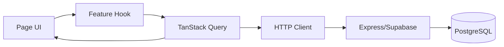

# TravelFlow State Structure

## 1) 현재 상태 구조 (As-Is)

## 1.1 전역 상태

- `AuthContext`
  - `user`
  - `login(userData, token)`
  - `logout()`
- 저장소
  - `localStorage.token`
  - `localStorage.user`
  - `localStorage.notifications`
  - `localStorage.theme, autoLogout, language, recentCities`

### To-Be 인증 상태

- AccessToken: 메모리 우선 저장(필요 시 localStorage fallback)
- RefreshToken: 클라이언트 JS 접근 불가(HttpOnly Cookie)
- `auth/session` 상태 예시
  - `user`
  - `accessToken`
  - `accessTokenExpiresAt`
  - `isRefreshing`

### 토큰 재발급 동시성 제어 규칙 (To-Be)

- 다중 API가 동시에 `401`을 받으면 refresh 요청은 1회만 수행
- 나머지 요청은 refresh 완료 Promise를 await 후 원 요청 재시도
- refresh 실패 시 대기 요청 전체를 실패 처리하고 공통 로그아웃 실행
- 루프 방지: 동일 요청의 refresh 재시도는 최대 1회

## 1.2 페이지/컴포넌트 로컬 상태

- `PackagePage`: `packages, selected, loading`
- `BookingLayout`: `checkIn/checkOut/adults/children/error/success`
- `PlannerPage`: 입력 폼 state만 존재(저장 미연결)
- `SuggestPage`: 입력/성공 메시지 로컬 처리
- `Points`: 포인트/쿠폰 목록 + 필터 + 페이징 + 모달 state
- `Logs`: 기간 필터 + 페이징 state

## 1.3 현재 구조 이슈

- 서버 상태를 컴포넌트별 `fetch + useState`로 중복 관리
- API 에러/로딩 처리 방식이 화면별로 달라 일관성 부족
- 인증 상태를 Context + localStorage에서 수동 동기화
- 더미 데이터/실데이터가 혼재되어 상태 책임이 불명확

## 2) 목표 상태 구조 (To-Be)

## 2.1 설계 원칙

- 인증 상태와 서버 상태를 분리
- 서버 상태는 Query 캐시 단일화
- UI 상태는 페이지 단위 local state 또는 경량 store 사용
- 토큰 재발급은 단일 큐(중복 refresh 방지)로 처리
- 도메인 데이터(예약/후기/포인트/플래너/여행제안)는 Supabase(PostgreSQL)를 단일 저장소(Source of Truth)로 사용
- localStorage는 UI 편의 상태(테마/언어/최근 조회 등)만 사용하고, 도메인 영속 데이터 저장 용도로 사용하지 않음

## 2.2 권장 라이브러리

- 서버 상태: TanStack Query
- 전역 UI 상태(선택): Zustand 또는 Context 최소화
- 폼 상태(선택): React Hook Form + Zod
- 스케줄러/큐(백엔드): BullMQ + Redis

## 2.3 권장 폴더 구조

```text
client/src/
  app/
    providers/
      AuthProvider.jsx
      QueryProvider.jsx
    router/
      routes.jsx
  features/
    auth/
      api.js
      hooks.js
      store.js
    bookings/
      api.js
      hooks.js
    reviews/
      api.js
      hooks.js
    points/
      api.js
      hooks.js
    profile/
      api.js
      hooks.js
  shared/
    lib/
      httpClient.js
    ui/
      Loading.jsx
      ErrorState.jsx
```

## 2.4 Query Key 규칙 예시

- `['auth', 'me']`
- `['packages', { page, filter }]`
- `['bookings', { status, page }]`
- `['bookings', bookingId]`
- `['reviews', 'reviewable']`
- `['points']`
- `['coupons']`
- `['loginLogs', { period, page }]`

### Query key 네이밍 규칙 (To-Be)

- 포맷: `['domain', 'resource', params]`
- params는 stable object 사용
- 금지
  - 랜덤값/Date 객체를 그대로 key에 사용
  - key 없이 수동 캐시 업데이트 남발

## 2.5 상태 책임 분리

- Auth
  - AccessToken 관리, Refresh 재발급 트리거, 현재 사용자 정보
- Domain Server State
  - packages, bookings, reviews, points, coupons, logs
- UI State
  - 모달 열림 여부, 폼 입력 임시값, 정렬/필터

## 2.6 Redis 캐시/스케줄 연계 원칙

- 캐시 적중 데이터는 Query 초기값으로 활용 가능
- Mutation 성공 시 관련 Query Key 무효화
  - 예: 쿠폰 등록 성공 -> `['coupons']`, `['points']` invalidate
- 스케줄러가 데이터 변경 시 서버에서 version 필드 또는 updated_at으로 캐시 무효화 힌트 제공

### Query invalidation 매트릭스 (To-Be)

| 이벤트           | invalidate keys                             |
| ---------------- | ------------------------------------------- |
| 로그인 성공      | `['auth', 'me']`                            |
| 프로필 수정 성공 | `['auth', 'me']`, `['profile']`             |
| 예약 생성 성공   | `['bookings']`, `['bookings', 'calendar']`  |
| 예약 취소 성공   | `['bookings']`, `['points']`, `['coupons']` |
| 후기 작성 성공   | `['reviews', 'reviewable']`, `['bookings']` |
| 쿠폰 등록 성공   | `['coupons']`, `['points']`                 |
| 알림 설정 변경   | `['auth', 'me']`, `['notifications']`       |

## 2.7 예시 흐름



## 2.8 Persistence 정책 (To-Be)

- localStorage
  - 유지: `theme`, `language`, `recentCities`
  - 금지: 예약/후기/포인트/플래너/여행제안 등 도메인 엔티티 저장
- memory only
  - `accessToken`, `isRefreshing`, refresh queue 상태
- HttpOnly Cookie
  - `refreshToken`
- sessionStorage(선택)
  - 민감하지 않은 임시 폼 draft

## 3) 전환 순서 권장

1. 공통 `httpClient` 도입(토큰 헤더, 에러 처리 통합)
2. Access/Refresh 토큰 흐름(재발급 인터셉터) 도입
3. `AuthContext`를 유지한 채 `GET /users/me` 동기화 추가
4. 더미 페이지부터 Query 기반으로 순차 전환
5. 예약/후기/쿠폰을 feature 단위 API 모듈로 분리
6. localStorage 의존 설정값을 설정 store로 정리

## 4) 즉시 반영 권장 체크포인트

- 리뷰 작성 요청 필드를 API 스펙과 동일하게 정렬
- 탈퇴 API 경로와 클라이언트 호출 경로 통일
- 로그인 API 호출 지점 단일화
- 실패/로딩 UI 공통 컴포넌트 도입
- Access 만료 시 refresh 1회 재시도 후 실패하면 로그아웃 처리
