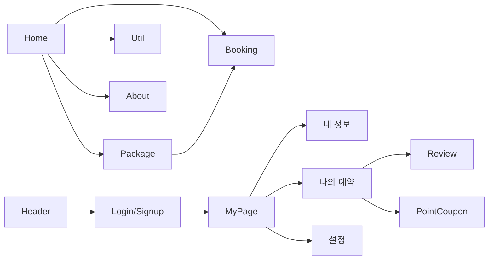

# TravelFlow Wireframe

## 1) 화면 구조 개요 (As-Is)

```mermaid
flowchart TD
  A[Public]
  A --> A1[/]
  A --> A2[/booking]
  A --> A3[/package]
  A --> A4[/planner]
  A --> A5[/suggest]
  A --> A6[/util]
  A --> A7[/about]
  A --> A8[/login]
  A --> A9[/signup]

  B[Private]
  B --> B1[/profile/info]
  B --> B2[/profile/edit]
  B --> B3[/profile/password]
  B --> B4[/profile/logs]
  B --> B5[/profile/withdraw]
  B --> B6[/myBookings/history]
  B --> B7[/myBookings/detail/:bookingId]
  B --> B8[/myBookings/cancel]
  B --> B9[/myBookings/review]
  B --> B10[/myBookings/review/:bookingId]
  B --> B11[/myBookings/points]
  B --> B12[/settings/app]
  B --> B13[/settings/notifications]
```

## 2) 페이지별 블록 구성 (As-Is)

### 홈 / (`/`)

- Header
- Hero
- Service
- ServiceStats
- Packages
- BookingSteps
- Reviews
- Subscription
- Footer

### 로그인 / 회원가입

- `/login`: 로그인 폼 + 소셜 로그인 + 비주얼 커버
- `/signup`: 회원가입 폼

### 예약/상품

- `/booking`: 날짜/인원 입력 UI (현재 서버 저장 없음)
- `/package`: 패키지 리스트 -> 상세 전환 (로컬 state)

### 유틸

- `/util`: 사이드바 기반 탭
- 환율 계산기(외부 API + 서버 프록시 API)
- 날씨 조회(현재 위치/도시 검색)
- 보험 가이드(정적 콘텐츠)

### 회사소개

- `/about`: 회사 정보 / 고객센터 섹션 스위칭

### 마이페이지 (Private)

- 내 정보: 조회/수정/비밀번호/로그인 기록/탈퇴
- 나의 예약: 예약 요약/상세/취소-환불/후기/포인트-쿠폰
- 설정: 앱 설정/알림 설정

## 3) 구현 상태 진단 (작성 중/더미 포함)

- 예약(`booking`)은 UI만 존재, 저장/조회 API 미연결
- 플래너(`planner`)는 `/api/planner` 연동으로 저장/최근 목록 조회 가능
- 제안(`suggest`)은 `/api/suggestions` 연동으로 제출/최근 목록 조회 가능
- 나의 예약(`history`, `detail`, `review`, `cancel`) 다수가 더미 데이터 기반
- 포인트/쿠폰은 서버 라우트가 존재하지만 더미 포인트/쿠폰 혼합

## 4) To-Be 와이어프레임 권장

### 핵심 원칙

- Public/Private 레이아웃 분리
- 마이페이지 공통 레이아웃을 단일 Outlet 구조로 통일
- 모든 목록 화면: 검색/필터/정렬/페이지네이션 패턴 통일

### 권장 화면 추가

- 예약 완료 페이지(`/booking/success`)
- 에러/빈 상태 공통 컴포넌트
- 토큰 만료/권한 실패 공통 안내 모달

### 권장 정보구조(IA)



## 5) UI 정리 우선순위

- 1순위: 더미 데이터 페이지를 실제 API 연결 전제 구조로 통일
- 2순위: 마이페이지 중첩 라우팅을 Outlet 방식으로 재구성
- 3순위: 공통 에러/로딩/빈 상태 컴포넌트 도입

## 6) 사용자 상태별 화면 매트릭스 (To-Be)

| 사용자 상태                | 접근 가능 화면                                          | 제한/리다이렉트                                                    | 공통 UI 처리                   |
| -------------------------- | ------------------------------------------------------- | ------------------------------------------------------------------ | ------------------------------ |
| 비로그인                   | `/`, `/package`, `/util`, `/about`, `/login`, `/signup` | `/profile/*`, `/myBookings/*`, `/settings/*` 접근 시 `/login` 이동 | 상단 우측 Login 노출           |
| 로그인                     | Public + Private 전체                                   | 없음                                                               | MyProfileBox 노출              |
| Access 만료 + Refresh 유효 | 현재 화면 유지                                          | 백그라운드 refresh 후 재요청                                       | 전면 차단 없이 로딩 인디케이터 |
| Access/Refresh 모두 만료   | Public만 접근                                           | Private 접근 시 `/login` 이동                                      | 세션 만료 토스트 + 로그인 유도 |
| 탈퇴 계정                  | `/login`, `/signup` 제한적                              | 로그인 시 재가입 안내 플로우                                       | 재활성화 CTA 노출              |

## 7) 비정상 상태 와이어프레임 규칙 (To-Be)

- 로딩 상태
  - 리스트 화면: 스켈레톤 카드/행 6~10개
  - 상세 화면: 제목/본문 스켈레톤 + 액션 버튼 disabled
- 빈 상태
  - 예약/후기/쿠폰 목록이 비어있을 때 일러스트 + CTA 제공
  - 예: "아직 예약이 없습니다" + "패키지 보러가기"
- 에러 상태
  - `401`: 세션 갱신 시도 -> 실패 시 로그인 유도 모달
  - `403`: 권한 없음 안내 + 이전 페이지 이동
  - `404`: 리소스 없음 안내 + 목록 복귀 버튼
  - `500`: 재시도 버튼 + 문의 링크

## 8) 반응형 레이아웃 기준 (To-Be)

- Breakpoint
  - Mobile: 0~767px
  - Tablet: 768~1279px
  - Desktop: 1280px+
- Header/Navigation
  - Mobile: 햄버거 메뉴 + 전체 화면 Drawer
  - Tablet/Desktop: 상단 고정 네비게이션
- 마이페이지
  - Mobile: 사이드바를 상단 탭/드롭다운으로 대체
  - Desktop: 좌측 사이드바 + 우측 콘텐츠 2열 구조 유지
- 목록 화면
  - 패키지 카드 그리드: 1열(Mobile) -> 2열(Tablet) -> 3열(Desktop)
