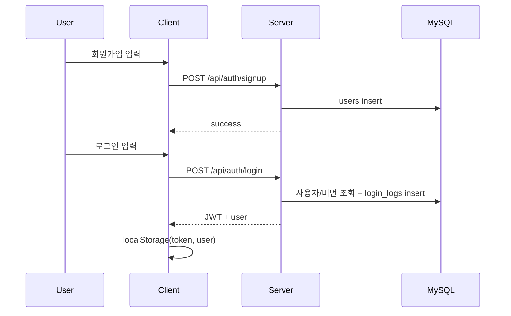
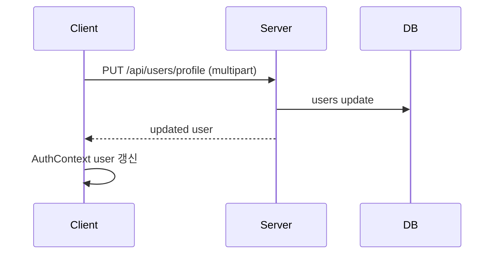
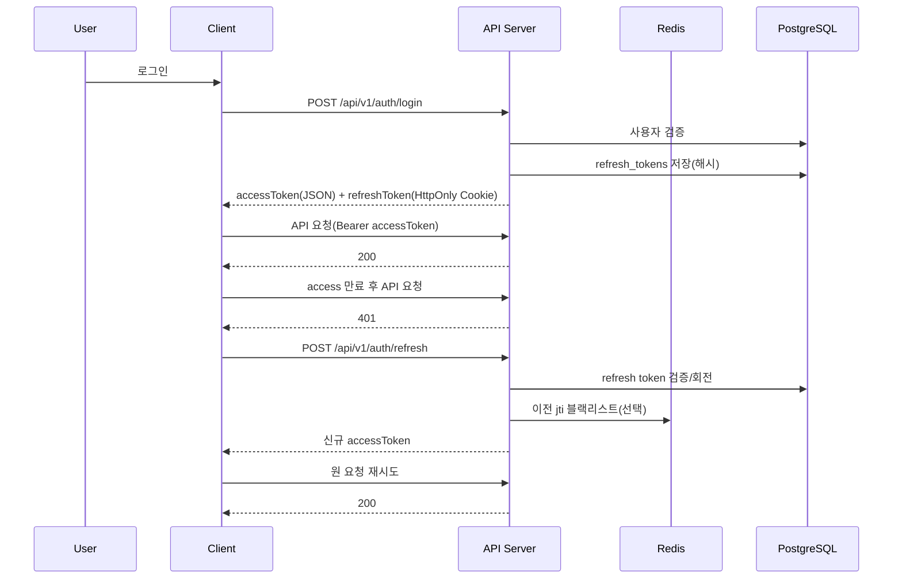
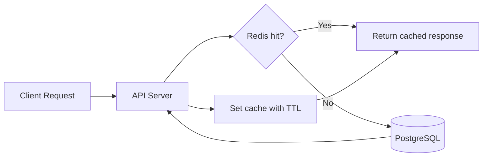

# TravelFlow Workflow

## 1) 기술 스택

### 현재(As-Is)

- Frontend: React 19, Vite 6, React Router 7, Tailwind CSS 4
- Backend: Node.js, Express 5
- Auth: JWT + localStorage
- DB: MySQL(`mysql2`), 파일 업로드는 로컬 `uploads/`
- External API: OpenWeather, ExchangeRate API, RestCountries

### 목표(To-Be, Supabase)

- Frontend: React + Vite 유지
- Backend: Express 유지(단계적), 이후 Supabase Edge Functions로 일부 이전 가능
- DB/Auth/Storage: Supabase(PostgreSQL, Auth, Storage)
- ORM: Prisma(스키마/마이그레이션/타입 안정성)
- Cache: Redis(조회 캐시, 토큰 블랙리스트, 레이트리밋 보조)
- Scheduling: Redis 기반 Job Queue(BullMQ) + cron 트리거
- Auth 전략: AccessToken(단기) + RefreshToken(장기) 분리
- 상태/서버 캐시: TanStack Query 권장

### 인증/캐시/스케줄 운영 가이드(To-Be)

- AccessToken: 10~30분 만료, API 인증용
- RefreshToken: 7~30일 만료, 재발급 전용
- RefreshToken 저장: HttpOnly + Secure Cookie 권장
- Redis 캐시 대상: packages, weather/exchange 단기 응답, 사용자 쿠폰 요약
- 스케줄 작업 예시: 쿠폰 만료 상태 반영, 예약 리마인더 발송, 포인트 만료 처리

## 2) 핵심 사용자 플로우 (As-Is)

### 회원가입/로그인



### 프로필 수정



### 포인트/쿠폰

- 조회: `GET /api/points`
- 등록: `POST /api/points/register`
- 현재는 DB + 더미 데이터가 혼합되어 반환됨

### 후기 작성

- 작성: `POST /api/review`
- 서버는 `bookingId, rating, comment, image`를 기대
- 프론트는 `content` 필드를 전송(불일치)

### 플래너/여행 제안 (MVP 보완)

- 플래너
  - 조회: `GET /api/planner`
  - 저장: `POST /api/planner` (`destination`, `travelDate`, `memo`)
- 여행 제안
  - 조회: `GET /api/suggestions`
  - 저장: `POST /api/suggestions` (`destination`, `suggestion`)

## 3) 현재 구조의 주요 병목

- 동일 로그인 요청이 중복 수행되는 흐름 존재(폼/페이지 양쪽)
- 더미 데이터와 실데이터가 혼재하여 책임 경계가 모호함
- 라우팅 중첩 구조가 복잡하여 유지보수 난이도 상승
- API 경로/필드 불일치가 일부 존재

## 4) 권장 워크플로우 (To-Be)

### 공통 원칙

- 클라이언트는 API 계약(요청/응답 타입)만 의존
- 화면 상태와 서버 상태를 분리
- DB 스키마 변경은 마이그레이션으로만 관리

### 개발 워크플로우

1. 요구사항 -> `api-spec.md` 갱신
2. DB 변경 -> `db-schema.md` + SQL migration 반영
3. 서버 구현 -> API contract test 통과
4. 프론트 연결 -> Query key/Mutation 규칙 적용
5. 배포 전 -> 시나리오 E2E(로그인, 예약, 후기, 쿠폰)

### Supabase 전환 워크플로우

1. MySQL 스키마를 PostgreSQL snake_case로 정리
2. Supabase 프로젝트 생성 + SQL 적용
3. Prisma 초기화(`schema.prisma`, `migrate`, `generate`) 및 모델 반영
4. 이미지 업로드를 Supabase Storage 버킷으로 변경
5. JWT를 Access/Refresh 구조로 분리하고 Refresh 저장소(테이블+Redis) 구성
6. 스케줄러 워커(BullMQ) 구성 및 주기 작업 등록
7. 기존 Express API는 BFF 역할로 축소

### Access/Refresh 토큰 생명주기 (To-Be)



### Redis 캐시 흐름 (To-Be)



### 스케줄러 실행 흐름 (To-Be)

```mermaid
flowchart TD
  CRON[cron trigger] --> Q[BullMQ enqueue]
  Q --> W[Worker]
  W --> JOB{Job success?}
  JOB -->|Yes| LOG1[job_runs success 기록]
  JOB -->|No| RETRY[재시도(backoff)]
  RETRY --> FAIL{max retries 초과?}
  FAIL -->|No| W
  FAIL -->|Yes| LOG2[job_runs failed 기록 + 알림]
```

## 5) 추천 단계별 로드맵

- Phase 1: API 계약 정리 + 더미 제거 계획 수립
- Phase 2: 예약/후기/포인트 실데이터 연결
- Phase 3: Supabase + Prisma 전환
- Phase 4: Access/Refresh 인증 + Redis 캐시 + 스케줄러 도입
- Phase 5: 모니터링/로그/권한 정책(RLS) 강화
